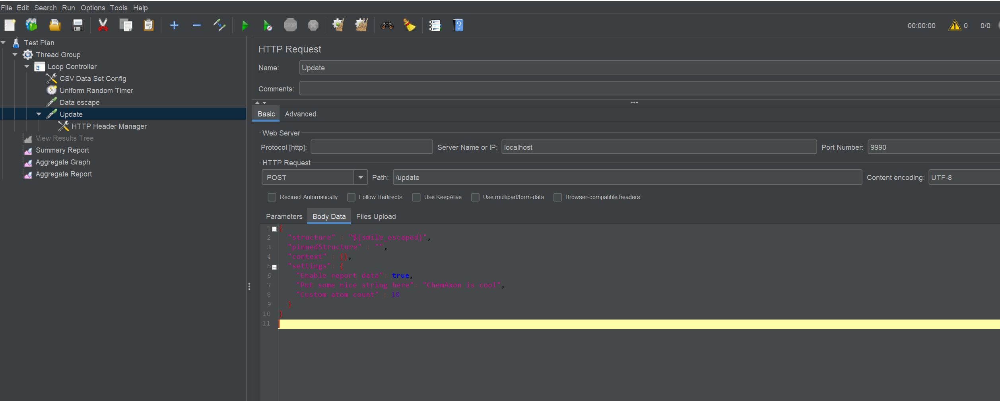

# Design hub realtime plugin example implementation for Java
Please see also doc here: 
https://docs.chemaxon.com/display/docs/design-hub-developer-guide-real-time-plugins.md

## How to implement a realtime plugin for Design hub
The only thing you need to do is to implement `com.chemaxon.designhub.plugin.interfaces.RealtimePluginInterface`
Source:  [RealtimePluginInterface](docs/RealtimePluginInterface.java)

Most simple way is to use this project and edit [PluginLogic.java](src/main/java/com/chemaxon/designhub/plugin/exampleimpl/PluginLogic.java) file.

## Chemaxon hub authentication
To be able to build this example project credentials for hub.chemaxon.com Maven repository must be configured. See documentation [here](https://docs.chemaxon.com/display/docs/public-repository.md#src-1806243-publicrepository-gradle) and example [gradle.properties](gradle.properties)

## Example
```
@Component
public class PluginLogic implements RealtimePluginInterface<PluginSettings> {

    final PluginSettings myDefaultSettings = new PluginSettings(
            new BooleanPluginSetting("Enable report data", true),
            new StringPluginSetting("Put some nice string here", ""),
            new NumberPluginSetting("Custom atom count", 4));

    ElementalAnalyser elementalAnalyser = new ElementalAnalyser();

    final Logger logger = LoggerFactory.getLogger(PluginLogic.class);

    public ResultSet getResultSet(String structure, String pinnedStructure, PluginSettings settings, Object context) {
        logger.debug("We just received some data!");
        try {
            MolImporter mi = new MolImporter(new ByteArrayInputStream(structure.getBytes()));
            Molecule mol = null;
            mol = mi.read();

            elementalAnalyser.setMolecule(mol);

            double exactMass = elementalAnalyser.exactMass();
            double mass = elementalAnalyser.mass();
            int massPrecision = elementalAnalyser.massPrecision();
            int atomCount1 = elementalAnalyser.atomCount(8); // oxygen atom count
            int atomCount2 = elementalAnalyser.atomCount(8, 0); // non-isotope oxygen count
            int atomCount3 = elementalAnalyser.atomCount(8, 16); // oxygen isotope count with massno=16
            String formula = elementalAnalyser.formula();
            String isotopeFormula = elementalAnalyser.isotopeFormula();
            String composition = elementalAnalyser.composition(2); // precision=2
            String isotopeComposition = elementalAnalyser.isotopeComposition(2); // precision=2

            // now use the results...

            ClientData clientData = new ClientData();

            clientData.setAtomCount1(atomCount1);
            clientData.setAtomCount2(atomCount2);
            clientData.setAtomCount3(atomCount3);

            clientData.setFormula(formula);
            clientData.setIsotopeFormula(isotopeFormula);
            clientData.setComposition(composition);
            clientData.setIsotopeComposition(isotopeComposition);

            // using settings
            int customAtomCountSetting = settings.getAtomCount().getValue().intValue();
            clientData.setCustomAtomCount(elementalAnalyser.atomCount(customAtomCountSetting));
            clientData.setSettingOfCustomAtomCount(customAtomCountSetting);

            if (settings.getReportEnabled().getValue()) {
                HashMap<String, Object> reportData = new HashMap<>();
                reportData.put("Oxygen atom count", atomCount1);
                reportData.put("Non-isotope oxygen count", atomCount2);
                reportData.put("Some boolean data", true);
                reportData.put("Some string data", "Report data!");
                return new ResultSet(clientData, reportData);
            }
            //Return null in the case this plugin should not provide any report data
            return new ResultSet(clientData, null);

        } catch (Exception e) {
            logger.error("There was an error processing this calculation structure: {}", structure);
            logger.error(e.getMessage());
            return new ResultSet(null, null);
        }
    }

    @Override
    public PluginSettings getSettings() {
        return myDefaultSettings;
    }

    @Override
    public String getLabel() {
        return "Example plugin label";
    }

    @Override
    public String getName() {
        return "example-java-plugin-name";
    }

    @Override
    public String getTemplate() {
        // For more details see docs: https://docs.chemaxon.com/display/docs/design-hub-developer-guide-real-time-plugin-templates.md
        return "<div>\n" +
                "  <p>Oxygen atom count: {{client.atomCount1}}</p>\n" +
                "  <p>Non-isotope oxygen count: {{client.atomCount2}}</p>\n" +
                "  <p>Oxygen isotope count with massno=16: {{client.atomCount3}}</p>\n" +
                "  <p>Custom set ({{client.settingOfCustomAtomCount}}) atom count: {{client.customAtomCount}}</p>\n" +
                "  <p>Formula: {{client.formula}}</p>\n" +
                "  <p>Isotope formula: {{client.isotopeFormula}}</p>\n" +
                "  <p>Composition: {{client.composition}}</p>\n" +
                "  <p>Isotope composition: {{client.isotopeComposition}}</p>\n" +
                "</div>";
    }
}
```

## Build and run

#### Build jar
`gradlew bootJar`

#### Run the plugin listening on port 9990
`java -jar build\libs\example-implementation-1-1.0-SNAPSHOT.jar`

or run plugin using Gradle task ```gradlew runPlugin```

#### Run tests
Run JUnit tests using ```gradlew test```

To test your plugin feel free to get insired by these curl commands:

**GET**
```
curl --location --request GET 'http://localhost:9990/'
```

**POST /update**
```
curl --location --request POST 'http://localhost:9990/update' \
   --header 'Content-Type: application/json' \
   --data-raw '{
   	"structure" : "CN1C=NC2=C1C(=O)N(C(=O)N2C)C",
   	"pinnedStructure" : "",
   	"context" : {},
   	"settings": {
       "Enable report data": true,
       "Put some nice string here": "ChemAxon is cool",
       "Custom atom count" : 10
     }
   }
'
```

#### Design Hub configuration 
To add this plugin to Design Hub to add this line to config.json. Replace `localhost:port` with the actual address the plugin is listening on.

```"remoteServices": ["http://localhost:9990"]```

#### Testing performance


For testing performance a simple JMeter [test plan](jmeter/performancetest.jmx) has been created. Performance test is designed to simulate real user load (calling `POST /update`) based on this rule:

Start 100 threads (simulating 100 simultaneously working users) doing:

```
while (true) {
    Fetch new test data from smiles.csv    
    Perform /update POST call
    Pacing time 2 seconds
    Repeat
}
```

Performance test script simulates logic of how Design Hub works with realtime plugins.
This is archived by following these rules:
- if previous request has not been finished do not send a new one
- if previous request had shorter response time than 2 seconds wait until 2 seconds passed since start of
previous request and send a new one 

These rules will create constant throughout of 50 request per second on /update endpoint for 100 of users. To change
this, change number of running threads. 

#### Test data
Data from [ChEMBL](https://www.ebi.ac.uk/chembl/) database has been exported (10000 rows) in [smiles.csv](jmeter/smiles.csv).
